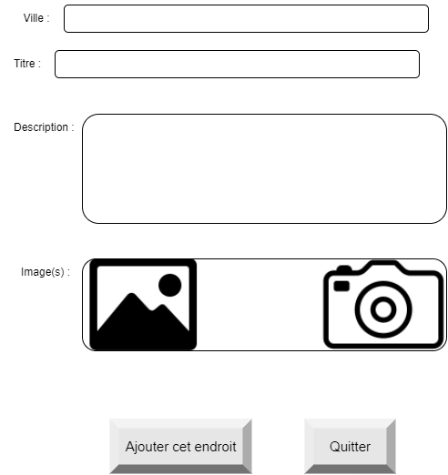

# Guide de mise à jour

Guide de mise à jour pour ajouter un champ ville à la table endroit pour permettre aux utilisateurs de voir et d'ajouter dans quelle ville l'endroit se situe.




Pour commencer, nous allons créer la nouvelle colonne avec une valeur par défaut pour que les endroits déjà créés aillent une valeur dans cette colonne.

Script à exécuter une fois sur le serveur en appelant l'url dans coter client creer-ville.php :
````
include_once 'Secret/Connexion.php'; //inclure le code de connexion

$basededonnees = Connexion::initialiser();
$demandeContrats = $basededonnees->prepare(ALTER TABLE `endroit` ADD `ville` VARCHAR(255) NOT NULL DEFAULT 'Inconnue' AFTER `description`); //valeur par défault pour que tous les champs aillent une valeur
$demandeContrats->execute();
````

## Modifier coter serveur

Dans la classe EndroitDAO, nous devons ajouterle nouveau champ à la fonction ajouter.

````
public static function ajouterEndroit($endroit){

    $basededonnees = EndroitDAO::initialiser();

    $demandeContrats = $basededonnees->prepare(EndroitDAO::SQL_AJOUTER_ENDROIT);
    $demandeContrats->bindParam(':titre', $endroit['titre'], PDO::PARAM_STR);
    $demandeContrats->bindParam(':description', $endroit['description'], PDO::PARAM_STR);
        $demandeContrats->bindParam(':ville', $endroit['ville'], PDO::PARAM_STR);
    $demandeContrats->execute();

}
````

Nous devons aussi ajouter le champ au fichier EndroitSQL.

````
const SQL_AJOUTER_ENDROIT = 'INSERT INTO endroit(titre, description, ville) VALUES(:titre, :description :ville)';
````

Il n'y a rien à ajouter dans les controleurs coter serveur.

## Modifier coter client

Dans la classe VueListeEndroitDetail ajouter les nouveaux champs dans la fonction ajouter.

````
afficher(listeEndroitDonnee) {
    this.listeEndroitDonnee = listeEndroitDonnee;

    console.log("VueListeEndroit " + this.listeEndroitDonnee);

    let html = "";

    for(let numeroEndroit in this.listeEndroitDonnee){

        let titre = this.listeEndroitDonnee[numeroEndroit].titre;
        let description = this.listeEndroitDonnee[numeroEndroit].description;
        let ville = this.listeEndroitDonnee[numeroEndroit].ville;
        let image = this.listeEndroitDonnee[numeroEndroit].image;

        console.log('titre endroit de VueListeEndroit : ' + titre);

        html += '<h1>' + titre + '</h1>';
        html += '<p class="mt-2 mb-5">' + description + '</p>';
        html += '<p class="mt-2 mb-5">' + ville + '</p>';
        html += '<div id="rotate-container">';
            html += '<div id="rotatable">';
                html += '';
            html += '</div>';
        html += '</div>';
        html += '<div id="interaction"></div>';
    }

    document.getElementById("endroit").innerHTML += html;
}
````

Dans la classe VueAjouterEndroit ajouter le nouveau champ dans la fonction enrgistrer.

````
enregistrer(evenement) {
    console.log("enregistrer");
    evenement.preventDefault();

    let titre = document.getElementById("titre").value;
    let description = document.getElementById("description").value;
    let ville = document.getElementById("ville").value;

    this.actionAjouterEndroit(new Endroit(titre, description, ville, null));
}
````

Dans la classe Endroit ajouter le nouveau champ.

````
class Endroit{
    constructor(titre, description, ville, id){
        this.id = id;
        this.titre = titre;
        this.description = description;
        this.ville = ville;
    }
}
````

Dans la classe EndroitDAO, nous devons ajouter le nouveau champ à la fonction ajouter.

````
ajouter(endroit){
    let requette = new XMLHttpRequest();

    if(!requette) {
        return null;
    }
    requette.onreadystatechange = function(){

        if (requette.readyState === XMLHttpRequest.DONE) {
            if(requette.status === 200){
                //alert(requette.responseText);
            }
            else {
                alert(requette.responseText);
                return null;
            }
        }
    }

    requette.open('POST', "http://services.mayal.systems/ajouter-endroit.php");
    requette.setRequestHeader('Content-Type', 'application/x-www-form-urlencoded');
    requette.send(`titre=${encodeURIComponent(endroit.titre)}&description=${encodeURIComponent(endroit.description)}&ville=${encodeURIComponent(endroit.ville)}`)
}
````

Il n'y a rien à ajouter dans les controleurs coter client.

## Intégrer les In-app updates

Nous allons utiliser ce plugin pour intégrer les In-app updates à cordova : https://www.npmjs.com/package/cordova-in-app-update?activeTab=readme

Nous devons commencer par installer le plugin avec npm.
````
npm i cordova-in-app-update
````

Ensuite, puisque nous voulons obliger l'utilisateur à faire la mise à jour, nous allons ajouter ce code à l'application pour faire une mise immédiatement.
````
window.plugins.updatePlugin.update(()=>{
    //log en cas de réussite
},()=>{
    //log en cas d'erreur
},{
   ANDROID: {
        type: "IMMEDIATE",
        stallDays: 5
    }
});
````